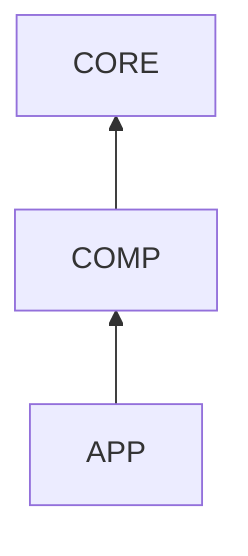

# Wide code block fixture

```bash
tsdown.config.ts vitest.ts lefthook.yml oxlintrc.json .editorconfig .gitattributes .gitignore .rignore .jscpd.json .gitlab-ci.yml ./ first+second+third+fourth+fifth+sixth+seventh+eighth+ninth+tenth packages/bundle/base packages/bundle/headless apps/cli ./
second line: web/skill/mcp/lsp -> session/storage/query -> api/client/web and pnpm run check:ci:static -> test suites/api ./
```

```powershell
Write-Host 'hello' # comment
$files = Get-ChildItem -Recurse -Filter *.md | Where-Object { $_.Length -gt 1KB }
foreach ($f in $files) { Write-Output ("LEN={0}" -f $f.Length) }
```

```csharp
var numbers = Enumerable.Range(1, 10).Where(n => n % 2 == 0); // comment
Console.WriteLine(string.Join(",", numbers));
```


