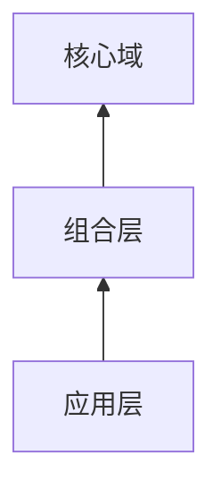
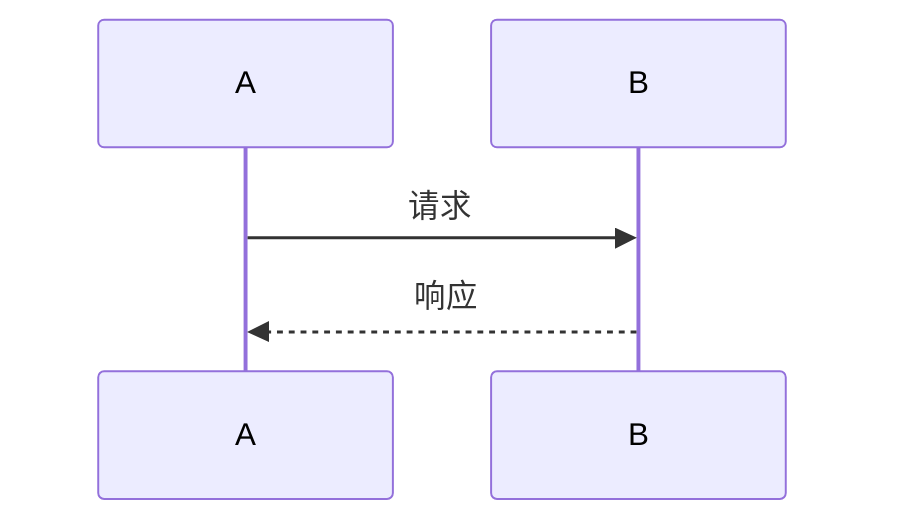

# 格式画廊

本文演示阅读器的完整格式支持：目录、告示、公式、图表。

[TOC]

## 告示块

> [!NOTE]
> 这是一条提示信息，用于补充说明。

> [!WARNING]
> 这是一条警告信息，请注意。

## 数学公式

行内公式 $E=mc^2$ 嵌在文字中，块级公式独占一行：

$$
\int_0^1 x\,dx = \frac{1}{2}
$$

## Mermaid 图表

点击任意图表可放大预览（滚轮缩放、拖拽平移、Esc 关闭）。

